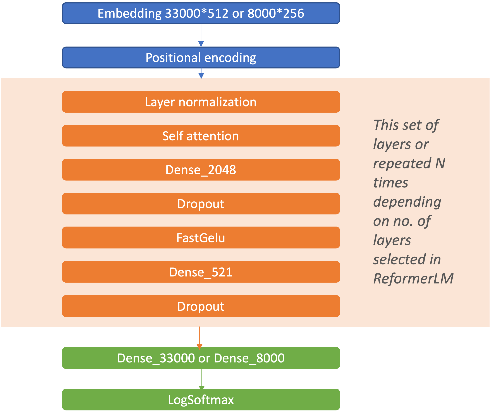

# :snowflake: Reformers in generating chatbot response


## 🌟 Highlights

This project is mainly focused on improving my understanding of sequence-to-sequence models, transformers and reformers with chatbots as an application example.

Here are the important sections of this reading:

- Abstract
- Initial exploration of models
- Datasets Description
- Pre-Processing of Data
- Reformer Model implementation
- Results and Conclusion
- Future Work


## 📗 Abstract

Chatbots have evolved from using rule base responses to providing responses by understanding the context and generating the associated response with the help of NLP. There are various NLP algorithms that are available to be trained on large corpus and serve as the backend response generators for chatbots. Given the impact chatbots have on easy of doing business and query resolutions, the research in developing algorithms for this use case in on rise. I intent to study the latest advancement in transformer algorithms namely reformer (an efficient transformer). Reformer model has brought down the complexity of training the models handling context windows of up to 1 million words, all on a single accelerator and using only 16GB of memory. I plan to understand the journey of sequence-to-sequence models to reformer models with chatbots as the use case.

##  :bookmark_tabs: Initial exploration of models

> *The total project has been like a journey of exploring Neural Network models in NLP. The flow of learning of models is as follows:
- N Grams neural networks
- RNN (Recurrent neural networks) : http://www.fit.vutbr.cz/research/groups/speech/publi/2010/mikolov_interspeech2010_IS100722.pdf
- Transformers: https://arxiv.org/pdf/1706.03762v5.pdf
- Reformers: https://arxiv.org/pdf/2001.04451.pdf

## :books: Datasets Description

> Dataset used for the project is MultiWOZ 2.1: https://arxiv.org/pdf/1907.01669v4.pdf

It a well-known task-oriented dialogue dataset containing over 10,000 annotated dialogues spanning 8 domains (hospital, restaurant, police, hotel, taxi, bus, train and attractions). It is extensively used as a benchmark for dialogue state tracking. About 3,406 are single-domain dialogues and remaining 7,032 are multi-domain dialogues consisting of at least 2 out of 5 domains. Dialogues with MUL refers to multi domain dialogues and SNG refers to single-domain dialogues.

The data is structired in a .json file. The dialogues will be a continuous conversation from the visitor and the responder. Each dialogue has goal, multiple user and system utterances as well as belief state and also the taks description from visitor's side is added. There is no one to one mapping between dialogue acts and sentences.

Example of a dialogue set from dataset:

```
am looking for a place to to stay that has cheap price range it should be in a type of hotel
Okay, do you have a specific area you want to stay in?
no, i just need to make sure it's cheap.
oh, and i need parking I found 1 cheap hotel for you that includes parking. Do you like me to book it?
Yes, please. 6 people 3 nights starting on tuesday.
I am sorry but I wasn't able to book that for you for Tuesday. Is there another day you would like to stay or perhaps a shorter stay?
how about only 2 nights.
Booking was successful. Reference number is : 7GAWK763. Anything else I can do for you?
No, that will be all.
Good bye. Thank you for using our services.
```

Dataset background: MultiWOZ 2.1 is developed from MultiWOZ 2.0 which has few shortcomings like noise in the dialogue state annotations and dialogue utterances. There has been a refinement down on it which resulted in changes to about 32% of state annotations across 40% of the dialogue turns. MultiWOZ 2.1 has been publicly released to the community. 

## :scissors: Pre-Processing of Data

The data is not directly in a shape to plug and play with the reformer model. Following modifications have been done to make it ready to be used and also easily distinguishable between 2 sides of the conversation.

#### :hash: Annotations and white space removal of dialogues:
As previously noticed on the above sample of dialogues from the conversation, there is no annotation of the speaker. I have added 'Person_A' and 'Person_B' for alternative texts. All the dialogues have also been trimmed for any extra spaces in the text (leading or ending).

#### :twisted_rightwards_arrows: Shuffle and Split
All the dialogues have been randomly shuffled. After considering the complexity of running the model, about 1500 dialogues are used for testing and remaining are used as test and evaluation sets.

#### :roller_coaster: Data pipelining (tokenization):
trax.data.Serail has been used to generate the streams of data with following variables:

- shuffle of input data
- 2 types of encodings used ('en_32k.subword' and 'en_8k.subword')
- length has been filtered to 2048
- buckets by length with boundaries = [128, 256, 512, 1024], batch_sizes = [16, 8, 4, 2, 1]


## :art: Reformer Model implementation

### :book: About Reformer: (https://arxiv.org/pdf/2001.04451.pdf)

Lately, transformers have achieved state-of-the-art results in various NLP tasks. most of the famous models like BERT, GPT3, T5 are based of transformers architecture. Trasnformers have been memory and compute intense models which require huge input data and larger computations with multiple layers. With multiple layers the memory needs have drastically increased and training transformers has been limited to people with very high computation resources. Reformers do play a crucial role here in reducing those memory needs and possibly run on smaller machines.

Reformers (efficient transformers) are built on the basis of transformers architecture. There are two major improvements in reformers:
 - Dot-product attention  is replaced by the one that uses locality-sensitive hashing which has changed the complexity from O(L^2) to O(L log L); L is the length of the input sequence.
 - Reversible residual layers have been used instead of the standard residual layers allowing less space to store activations (once in training process instead of N (no of layers) time).

### :pencil: Model Architecture:

Reformer model has been used with multiple configurations. Hyper parameters considered in evaluating different models are as follows:
 - vocab size: used 8k and 33k words (inbuilt in trax.reformerLM)
 - number of lakes: used 1, 4 and 6 layers
 - attention_type = self-attention is used
 - lr_schedules with warmup and rsqrt decay
 - cross entropy loss is used along with Adam optimizer
 - trax.training.loop object is used to do incremental training on the data with variable epochs in ranges of 50, 500, 1000 and 10,000

Model architecture is as below:




### :bicyclist: Training:

Model is trained using the Trax.training.loop object from Trax library with does the incremental training for the number of epochs specified. Model training with 6 layers, 33000 word embedding resulted in training about 70 million trainable weights, where as model with 8000 word embedding and 3 layers resulted in about 40 million trainable weights.

Challenges: It became impossible to install Trax library in my MacBook Pro with M1 chip and also wasn't able into instal in windows with intel i7 and Nvidia GeForce 3060 graphics card. So, total models are trained in google Colab with Colab pro subscription. Tesla A100 graphic card with about 30GB GPU memory is used. Training times are as below:

| Layers      | Embedding | Epochs     | Time (hours) | 
| :---        |    :----:   |          :---: |          ---: |
| 6      | 32k       | 1,000   |1.5   |
| 6   | 32k        | 10,000      |6      |
| 6   | 8k        | 1,000      |1      |
| 6   | 8k        | 10,000      |4      |

Note: Training multiple models has become a challenge as 1 hour of training in Colab would require about 10-13 computation units with costs of about $1, translating $1/hour as the cost. So, I have only trained 3-4 different models.


## :bar_chart: Results and Conclusion

#### Results:
As mentioned earlier there were only 3-4 trained models and couldn't experiment much with the model architecture as anything less than 6 layers and 10,000 epochs resulted in accuracies less than 40-50%. Below, chart summaries the training accuracy of 4 different models:

| Layers      | Embedding | Epochs     | Weighted Accuracy | 
| :---        |    :----:   |          :---: |          ---: |
| 6      | 32k       | 1,000   |8%   |
| 6   | 32k        | 10,000      |53%      |
| 6   | 8k        | 1,000      |6%     |
| 3   | 32k        | 10,000      |41%      |

One reformer model that I referred to in building my model has resulted in 62% accuracy with 6 layers, 32k embedding and 20,000 epochs.

#### Example output:

On the best trained model I have run text generation with some starter text and the conversation has proceeded as below:
```
Person_A: Where can I find the restaurant?
Person_B: The pizza hut city centre is located at Finders Corner Newmarket Road.
Person_A: What is the postcode?
Person_B: The postcode is cb294n.
Person_A: Thanks, that's all I need. for now.
Person_B: You're welcome. enjoy your day!us.
Person_A: Thanks, you too.
Person_B: You're welcome. Have a great day!Person_A
```
In above conversation one can notice that there are some unexpected texts like "for now", "!us." and "Person_A" as ending which speaks about the less accuracy of results. In general the training data does have some lengthy conversations where the in multiple cases the auto-conversations generated were short, which possibly may be due to lower accuracy of the model itself which is unable to comprehend larger contextual conversations.

#### Conclusion:

Considering the number of trainable wieghts ~70million model did train quit well with about 6-7 hours using google collars Tesla A100 graphic boosting. For the accuracy if about 50-60% other models on MultiWOZ data might take much longer training times and that would be even higher for models involving transformers with similar complexity of the architecture. Some of the highly trained models on MultiWOZ have attained accuracies of about 70-80% as per the documentation in the dataset description.

## :christmas_tree: Future Work

- As soon as there are feasible solutions for Trax library installations in M1, I want to continue this work on reformers and want to work with much deeper layers and less embedding
- I am looking for to understand the trade offs between depth of neural network with the length of embeddings.
- Also, looking to train a model in chucks by storing the weights and reusing them in further trainings without loosing the weights learnt from earlier training